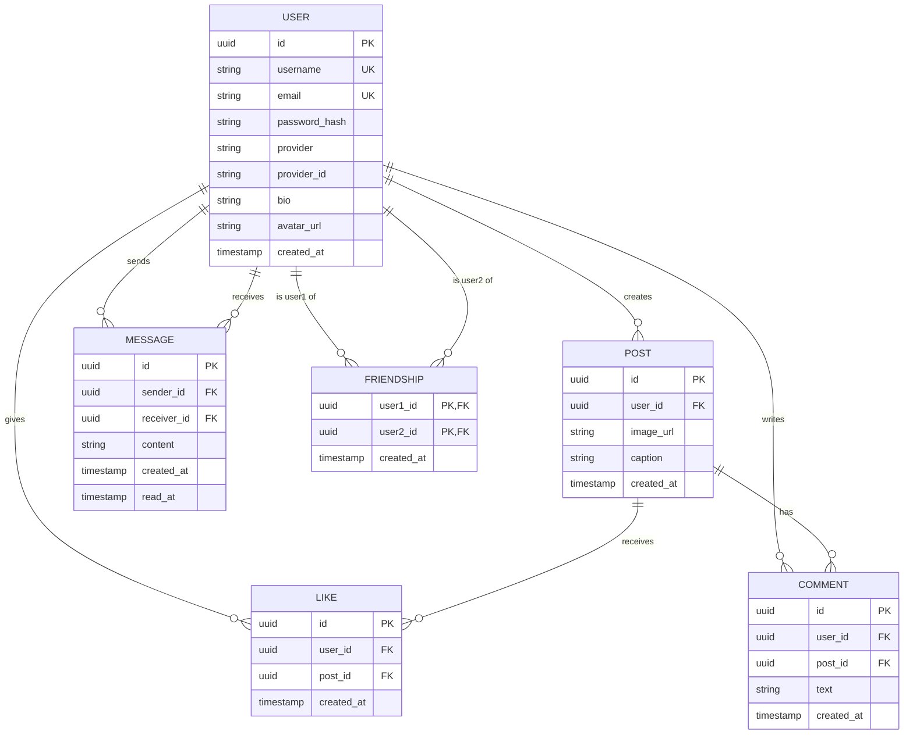

*This activity has been created as part of the 42 curriculum by rzins, bevergna, rcastel, rboughan, masalvad.*

# Transcendance

## Description

**Transcendance** is a full-stack social network web application built as the final project of the 42 Common Core. Users can create an account, build a profile, share picture posts, like and comment on other users' posts, add friends, and exchange private messages in real time.

The goal of the project was to design, build, and ship a complete, production-shaped web application as a team: a secure authentication system, a relational database with well-defined relations, a responsive and accessible frontend, real-time features over WebSockets, and a fully containerized deployment served over HTTPS.

### Key features

- Email/password authentication with hashed & salted passwords, plus Google OAuth 2.0 login.
- User profiles with editable bio and uploadable avatar (auto-resized on upload).
- Post creation with image upload, likes, and comments.
- Friend system (add/remove friends, view friends list, online status).
- Real-time private messaging over WebSockets, with message history.
- Advanced search with filters, sorting, and pagination.
- Full internationalization-ready, WCAG 2.1 AA accessible interface, tested across multiple browsers.
- Cookie consent banner, Privacy Policy and Terms of Service pages.
- Single-command containerized deployment (Docker/Podman) behind an Nginx HTTPS reverse proxy.

## Instructions

### Prerequisites

- [Docker](https://www.docker.com/) with `docker compose`, **or** [Podman](https://podman.io/) with `podman-compose`
- `make` (all commands are wrapped in the `Makefile`)
- A [Supabase](https://supabase.com/) project (the PostgreSQL database and file storage are not containerized — they stay remote)
- A Google Cloud OAuth 2.0 client (for Google login)
- A [Cloudinary](https://cloudinary.com/) account (for image hosting)

### Environment configuration

Copy the example file and fill in your own credentials:

```bash
cp .env.example .env
```

Required variables (see `.env.example`):

| Variable | Purpose |
| --- | --- |
| `DATABASE_URL` | Supabase pooled connection (pgBouncer, port 6543) |
| `DIRECT_URL` | Supabase direct connection (port 5432), used for migrations |
| `JWT_SECRET` | Secret used to sign session JWTs |
| `SUPABASE_URL` / `SUPABASE_SECRET_KEY` | Supabase project credentials |
| `CLOUDINARY_CLOUD_NAME` / `CLOUDINARY_API_KEY` / `CLOUDINARY_API_SECRET` | Image upload/storage |
| `GOOGLE_CLIENT_ID` / `GOOGLE_CLIENT_SECRET` | Google OAuth 2.0 |
| `OAUTH_REDIRECT_BASE` | Must match the HTTPS URL you open in the browser (e.g. `https://localhost:3000`) |
| `HTTPS_PORT` | Host port exposed by the HTTPS proxy (must match `OAUTH_REDIRECT_BASE`) |
| `NEXT_PUBLIC_SUPABASE_URL` / `NEXT_PUBLIC_SUPABASE_KEY` | Supabase client-side keys |

`.env` is git-ignored; only `.env.example` (with placeholder values) is committed.

### Running the project (single command)

```bash
make up          # builds the images and starts the stack
```

Then open **https://localhost:3000** (accept the self-signed certificate warning — HTTPS is generated locally by the Nginx proxy).

Other useful targets:

```bash
make logs        # follow container logs
make down        # stop the stack (keeps the generated certificate)
make re          # rebuild from scratch
make clean       # remove containers, volumes and local images
make migrate     # apply Prisma migrations to the remote Supabase database (opt-in)
```

The stack is composed of two services (see `compose.yaml`): `app` (the Next.js production server, internal only) and `proxy` (Nginx, terminates HTTPS and forwards to `app`). The database itself is not containerized: it stays remote on Supabase, so every deployment shares the same schema without needing a local Postgres container.

### Local development (without Docker)

```bash
npm install       # also runs `prisma generate` via postinstall
npm run dev
```

## Team Information

| Login | Name | Role(s) | Responsibilities |
| --- | --- | --- | --- |
| `rzins` | Rémy Zins | Project Manager / Scrum Master | Organized team coordination, tracked progress against the module plan, and was the most active frontend contributor: graphic charter, global CSS, navbar, post creation, likes, comments, and search integration. |
| `bevergna` | Benjamin Vergnaud | Product Owner | Defined and validated the product's user-facing flows: login/signup/logout pages, cookie consent banner, and accessibility compliance (WCAG 2.1 AA) across the app. |
| `rcastel` | Romain Castel | Technical Lead / Architect | Owned the real-time architecture: WebSocket-based private messaging, message history, and the friend system, and reviewed related technical decisions. |
| `rboughan` | Ryhad Boughanmi | Developer | Containerized the application (Docker/Podman + Nginx reverse proxy), set up end-to-end HTTPS, implemented Google OAuth 2.0 login, built the image-resizing pipeline for uploads, and wrote this README. |
| `masalvad` | Matéo Salvador | Developer | Implemented the Privacy Policy and Terms of Service pages and their content, and contributed to bug fixes across the app. |

## Project Management

- **Task organization**: the team tracked all work item-by-item on a Notion board organized by status (`TODO`, `In Progress`, `To be Reviewed`, `Done`), with one card per feature/module and an assignee on each card.
- **Work breakdown**: the mandatory part and each module were broken down into small, independently shippable tasks (e.g. "Navbar", "likes", "amis", "realtime-features (messages)", "containerization"), each tracked as its own card and its own feature branch.
- **Git workflow**: every feature was developed on a dedicated branch (e.g. `dockerization`, `google-oAuth`, `real-time-messages-rom`, `privacy`, `search_filters`, `friendship-rom`) and merged into `dev`/`main` through pull requests, keeping history readable and work distribution traceable per author.
- **Code reviews**: pull requests were reviewed by at least one other team member before being merged, especially for cross-cutting changes such as dockerization and HTTPS setup.
- **Communication**: the team communicated and synced progress through a shared Discord channel, in addition to the Notion board which served as the single source of truth for task status.

## Technical Stack

- **Frontend**: [Next.js](https://nextjs.org/) (App Router) with React 19 and TypeScript — chosen as a full-stack framework so the frontend and backend share the same codebase, language, and deployment pipeline.
- **Backend**: Next.js API routes (Node.js/TypeScript), using the same full-stack framework as the frontend.
- **Styling**: [Material UI](https://mui.com/) (with Emotion) combined with [Tailwind CSS](https://tailwindcss.com/) utility classes, plus a custom graphic charter (colors, typography, icons) applied across reusable components.
- **Database**: PostgreSQL, hosted on [Supabase](https://supabase.com/) — chosen for its managed Postgres offering, built-in connection pooling (pgBouncer) for serverless-style workloads, and integrated storage/auth tooling.
- **ORM**: [Prisma](https://www.prisma.io/), for type-safe database access and versioned migrations.
- **Authentication**: `bcryptjs` for password hashing/salting, `jose` for signed JWT sessions, and Google OAuth 2.0 for remote authentication.
- **Real-time**: WebSockets for live private messaging and online-status updates.
- **File storage**: [Cloudinary](https://cloudinary.com/) for avatar and post image hosting, with server-side image resizing before upload.
- **Validation**: [Zod](https://zod.dev/) schemas shared between frontend forms (via `react-hook-form`) and backend API routes.
- **Deployment**: Docker (with Podman as a drop-in alternative) and Nginx as an HTTPS-terminating reverse proxy, orchestrated with `docker compose` / `podman-compose` and started with a single `make up` command.

## Database Schema



- `User` is the central entity: it owns posts, likes, comments, sent/received messages, and both sides of a friendship. `provider`/`provider_id` support both local (email/password) and OAuth accounts, enforced unique together.
- `Post`, `Like`, and `Comment` cascade-delete with their parent `User`/`Post`, and `Like` enforces one like per user per post via a unique constraint.
- `Message` is indexed on both `(senderId, createdAt)` and `(receiverId, createdAt)` to keep conversation history queries fast, and tracks `readAt` for read receipts.
- `Friendship` uses a composite primary key on `(user1Id, user2Id)` to represent a mutual friend relationship without duplication.

## Features List

| Feature | Description | Contributor(s) |
| --- | --- | --- |
| Sign up / Log in / Log out | Email + password authentication with hashed & salted passwords | Benjamin Vergnaud |
| Google OAuth 2.0 login | Remote authentication via Google | Ryhad Boughanmi |
| Profile page & edit profile | View and update username, bio, and avatar | Rémy Zins, Benjamin Vergnaud |
| Avatar upload with resizing | Client/server-validated avatar upload, auto-resized before storage | Ryhad Boughanmi |
| Create / view posts | Upload an image with a caption to the user's feed | Rémy Zins |
| Likes | Like/unlike a post, one like per user per post | Rémy Zins |
| Comments | Comment on posts | Rémy Zins |
| Friends system | Add/remove friends, view friends list and online status | Romain Castel |
| Real-time private messaging | WebSocket-based 1:1 chat with message history | Romain Castel |
| Advanced search | Search users/posts with filters, sorting, and pagination | Rémy Zins |
| Accessibility compliance | WCAG 2.1 AA support: keyboard navigation, screen reader support | Benjamin Vergnaud |
| Cross-browser support | Verified on Chrome plus two additional browsers | Benjamin Vergnaud |
| Cookie consent banner | GDPR-friendly cookie notice | Benjamin Vergnaud |
| Privacy Policy & Terms of Service | Accessible footer-linked legal pages with real content | Matéo Salvador |
| Custom design system | Graphic charter + 10+ reusable styled components | Rémy Zins |
| Containerized deployment | Docker/Podman stack, single-command startup | Ryhad Boughanmi |
| HTTPS everywhere | Nginx reverse proxy terminating TLS in front of the app | Ryhad Boughanmi, Rémy Zins |

## Modules

| Category | Module | Type | Points | Implemented by |
| --- | --- | --- | --- | --- |
| Web | Use a framework for both the frontend and backend (Next.js) | Major | 2 | Rémy Zins, Ryhad Boughanmi |
| Web | Implement real-time features using WebSockets | Major | 2 | Romain Castel |
| Web | Allow users to interact with other users (chat, profile, friends) | Major | 2 | Romain Castel, Rémy Zins |
| Web | Use an ORM for the database (Prisma) | Minor | 1 | Rémy Zins, Ryhad Boughanmi |
| Web | Server-Side Rendering (SSR) | Minor | 1 | Rémy Zins |
| Web | Custom-made design system (10+ reusable components) | Minor | 1 | Rémy Zins |
| Web | Advanced search with filters, sorting, and pagination | Minor | 1 | Rémy Zins |
| Web | File upload and management system | Minor | 1 | Ryhad Boughanmi |
| Accessibility and Internationalization | Complete accessibility compliance (WCAG 2.1 AA) | Major | 2 | Benjamin Vergnaud |
| Accessibility and Internationalization | Support for additional browsers | Minor | 1 | Benjamin Vergnaud |
| User Management | Standard user management and authentication | Major | 2 | Benjamin Vergnaud, Rémy Zins |
| User Management | Remote authentication with OAuth 2.0 (Google) | Minor | 1 | Ryhad Boughanmi |
| Modules of choice | Image resizing pipeline for uploads | Minor | 1 | Ryhad Boughanmi |
| **Total** | | | **18** | |

### Justification — Modules of choice: image resizing pipeline (Minor, 1pt)

- **Why we chose this module**: uploaded avatar and post images come directly from users' devices at arbitrary resolutions and file sizes, which would otherwise slow down page loads, waste Cloudinary storage/bandwidth, and produce inconsistent layouts across the grid/profile UI.
- **Technical challenge it addresses**: images are resized and normalized (dimensions/compression) client-side before being sent to the server, and validated again server-side before upload, so the upload pipeline stays fast and the stored assets stay consistent regardless of the source image.
- **Value added**: faster uploads and page loads, predictable image dimensions across the UI (post grid, avatars), and lower storage/bandwidth usage on Cloudinary.
- **Scope**: this is deliberately a smaller, focused piece of work compared to a Major module — a single, well-defined transformation step in the existing upload flow — which is why it is claimed as Minor (1 point) rather than Major.

Modules considered but **not** claimed (started or discussed, but not completed to a demonstrable standard, and therefore excluded from the total above): the public API with a secured API key/rate limiting, the advanced permissions (roles/CRUD) system, and the organization system.

## Individual Contributions

- **Rémy Zins (`rzins`) — Project Manager**: drove the frontend of the application end-to-end — the graphic charter and global styling, the navbar, the post creation/feed flow, likes, comments, and the advanced search with filters/sorting/pagination. Also tracked the module checklist and kept the team aligned on scope versus the 14-point target.
- **Benjamin Vergnaud (`bevergna`) — Product Owner**: built the authentication-facing pages (login, signup, logout), the cookie consent banner, and led the accessibility work (WCAG 2.1 AA compliance, cross-browser testing) so the product met the mandatory user-facing and compliance requirements.
- **Romain Castel (`rcastel`) — Technical Lead**: designed and implemented the real-time messaging architecture over WebSockets (including message history and reconnection handling) and the friend system, and reviewed the technical decisions around them.
- **Ryhad Boughanmi (`rboughan`) — Developer**: containerized the whole application with Docker/Podman and Nginx, set up end-to-end HTTPS with a self-signed certificate for local/dev use, implemented Google OAuth 2.0 login, built the image-resizing upload pipeline, and authored this README.
- **Matéo Salvador (`masalvad`) — Developer**: wrote and integrated the Privacy Policy and Terms of Service pages with real, project-relevant content, and helped fix bugs surfaced during integration (e.g. user list not refreshing when a new user was created).

**Challenges faced**: getting HTTPS to work consistently between the Nginx proxy and Google's OAuth redirect URI required careful alignment of `OAUTH_REDIRECT_BASE` and `HTTPS_PORT` across environments; this was solved by centralizing both in `.env`/`.env.example` and documenting the constraint above. Keeping the WebSocket connection stable across reconnects for private messaging also required iteration, tracked and fixed across several `real-time-messages` branches.

## Known limitations

- The database (Supabase Postgres) is intentionally not containerized; a working Supabase project is required to run the stack.
- The self-signed certificate generated by the Nginx proxy will show a browser warning on first load — this is expected for local/dev deployments.


## Resources

- [Next.js documentation](https://nextjs.org/docs)
- [Prisma documentation](https://www.prisma.io/docs)
- [Supabase documentation](https://supabase.com/docs)
- [Material UI documentation](https://mui.com/material-ui/getting-started/)
- [Tailwind CSS documentation](https://tailwindcss.com/docs)
- [MDN Web Docs — WebSockets API](https://developer.mozilla.org/en-US/docs/Web/API/WebSockets_API)
- [Web Content Accessibility Guidelines (WCAG) 2.1](https://www.w3.org/TR/WCAG21/)
- [OAuth 2.0 / Google Identity documentation](https://developers.google.com/identity/protocols/oauth2)

### How AI was used

AI assistance (Claude) was used strictly as a support tool, never to produce the application's source code. Concretely, it was used for:

- Drafting and structuring this `README.md` (sections, formatting, wording).
- Writing supporting documentation and code comments explanations.
- Helping diagnose and explain bugs (e.g. reasoning about a stack trace or an unexpected behavior) that a team member then fixed by hand.

All production code (frontend, backend, database schema, Docker/Nginx configuration) was written and understood by the team members listed below, who can each explain and justify their contributions during the peer review.

## License

This project was built for educational purposes as part of the 42 curriculum and has no specific license beyond that context.
