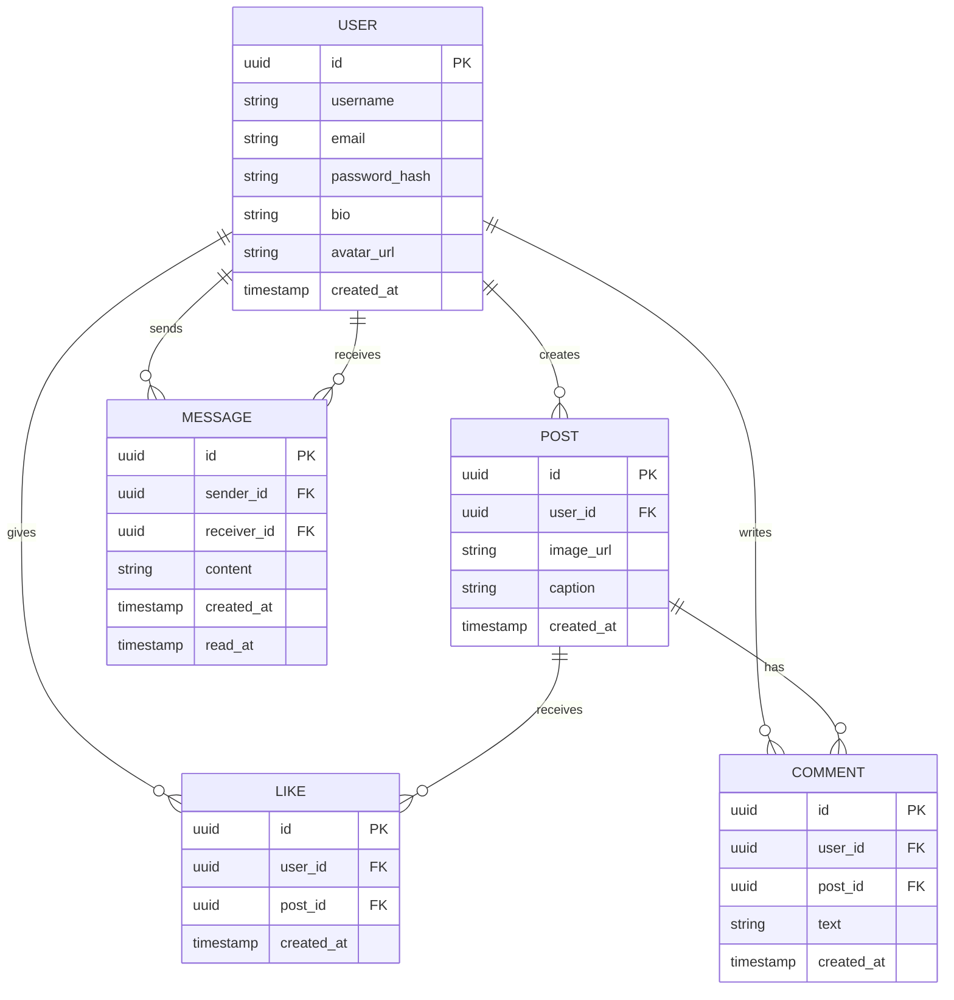

Prisma

choose how you want to set up your database:

CONNECT EXISTING DATABASE:

1. Configure your DATABASE_URL in prisma.config.ts
2. Run prisma db pull to introspect your database.

CREATE NEW DATABASE:
Local: npx prisma dev (runs Postgres locally in your terminal)
Cloud: npx create-db (creates a free Prisma Postgres database)

Then, define your models in prisma/schema.prisma and run prisma migrate dev to apply your schema.

Learn more: https://pris.ly/getting-started

